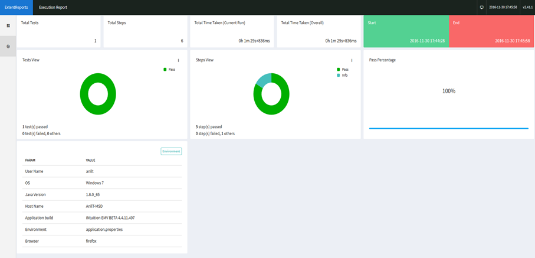
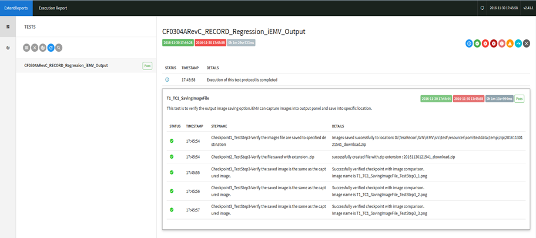
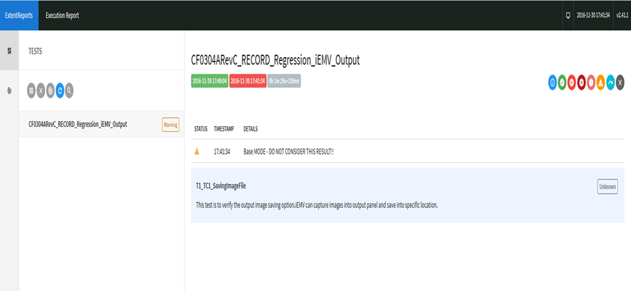
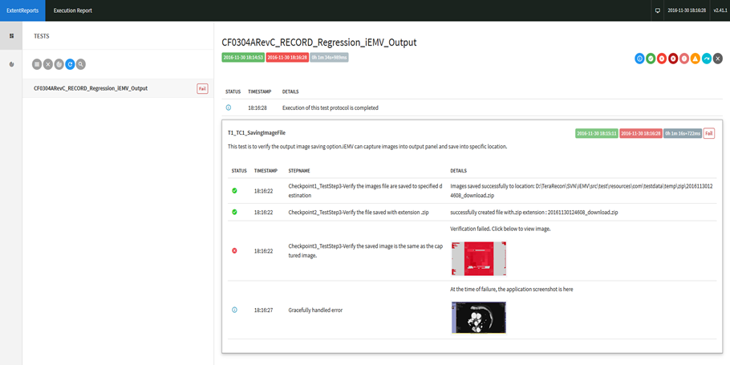
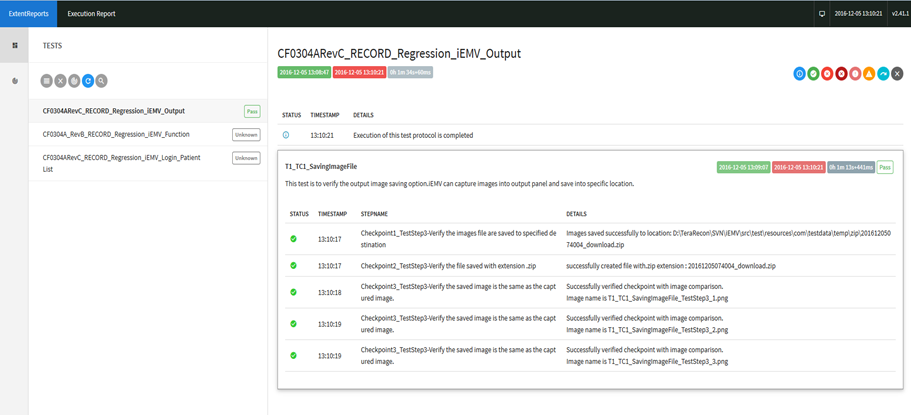

NorthStar Automation Test Repository
===============

# How to use this repository and branch

* Clone this repository.
* Create a branch from master.
* Commit changes to the local branch.
* Push the local branch to this repository specifing the same branch name as the local branch.
* Login to the GitLab web page and navigate to the "Merge Requests" tab.
* Select "New Merge Request" button.
* Select the newly pushed branch as the source branch and master as the target branch.
* Press "Compare branches and continue".
* Complete the new merge request information (title, description), select "Remove source branch when merge request is accepted", and assign it to a Master user.
* Verify in the "Commits" and "Changes" tabs at the bottom that it matches the intend of the merge request (Only the commits and changes needed should be listed here, if more are listed something is not correct either in the branch or in the merge request).
* Press "Submit merge request".
* Wait for the Master user comments on the merge request and update the code accordingly.
* Eventually the Master user will accept the merge request and the code will be merged into the master branch.

# Branches

* The default branch is called "master" and it will be used for releases.
* All the other branches are considered featured branches and are only intended for development, not for production.

# NorthStar Automation 

The objective of this document is to document the steps to create a development environment to automate NorthStar application.
In order to automate with selenium WebDriver, there are some pre-requisites that need to be setup like IDE and plug-ins, environment setup.

# Getting started

These instructions will get you a copy of the project up and running on your local machine for development and testing purposes. See deployment for notes on how to deploy the project on a live system.

# Prerequisites 

Following components are required to setup -

1. Eclipse IDE
2. Java 1.8
3. Maven

Below components will get downloaded as part of framework -
1. Selenium webdriver
2. TestNG 
3. ExtentReport
4. compare.exe 

## Setup IDE - Eclipse
1. Install or download any java development supported integrated development environment (IDE)
2. It would be better to use one IDE consistently since each IDE have different folder/file structure
3. Refer Comparison of integrated development environments for various IDE
4. Recommended IDE is Eclipse
5. Click on eclipse.exe file
6. Workspace Launcher would be displayed. Input Workspace folder path
7. Install Maven with below steps:
    a. Open Eclipse IDE
	b.  Click Help -> Install New Software...
    c. Click Add button at top right corner
	d. At pop up: fill up Name as "M2Eclipse" and Location as  http://download.eclipse.org/technology/m2e/milestones/1.0
	e. Now click OK
8. Install TestNG plugins with below steps:
	a. Open Eclipse IDE
	b. Click Help -> Install New Software...
	c. Click Add button at top right corner
	d. At pop up: fill up Name as "TestNG" and Location as  http://beust.com/eclipse/
	e. Now click OK

## Java Installation

- Install Java JDK 1.8 or above. Steps below -
    *  Open the Java SE Download page with this 
    URL: http://www.oracle.com/technetwork/java/javase/downloads
    * Click the download button next to "Java Platform (JDK) 8". You will see a new page with a list of different download files of JDK 8.
	* Locate the "Java SE Development Kit 8" section.
	* Click the hyper link of "jdk-8-windows-x64.exe", next to "Windows x64“
	* Save jdk-8-windows-x64.exe to a temporary directory.
	* Double-click on jdk-8-windows-x64.exe to start the installation wizard.
	* The installation wizard will guide you to finish the installation.
- Set the environment variable JAVA_HOME to C:\Program Files\Java\jdk_version [version of java installed]
- Verify Java installation on your machine - open Command Console and execute command -
	java –version
- On successful installation, java version is displayed in the console

## Setup Maven
* Download maven archive For e.g. apache-maven-3.3.9-bin.zip
* Extract maven archive to “C:\Program Files\Apache Software Foundation” 
[you can also extract it anywhere and provide the path of it]
* Create environment variable in Advance System Settings?Environment Variables (Create new under System variables) 
* M2_HOME=C:\Program Files\Apache Software Foundation\ apache-maven-<version of maven>
* M2=%M2_HOME%\bin
* MAVEN_OPTS=-Xms256m -Xmx512m
* Add maven bin directory location to %path% environment variable
* Append  ;%M2% to the end of the system variable Path.
*  Open command prompt, execute the following command -
	mvn –version
* On successful installation, maven version is displayed in the console

## Source code 

*   Install Git
*	Install Tortoise Git
*	Clone the NorthStar repository
*	Execute the 'git pull' command from git bash or using tortoise git
*	Source code will be done at your respective work location

## Import the project in eclipse

*	Import project in Eclipse from File?Import?Maven?Existing Maven Projects ?Next and provide the root folder of project.
*	After import is completed, set the Project Facet after selecting project and  
	and then File > Properties > Project Facet and change value of Java to 1.8
	
## Database Configurations for Automation

* From the SQL Server Express machine, launch SQL Center Configuration Manager.
* Expand SQL Server Network Configuration.
* Select the instance for your Orion NPM installation. By default, this will be Protocols for SQLEXPRESS.
* Change the Named Pipes protocol option to Enabled. The default Pipe Name setting is fine. 
* Click OK.
* Change the TCP/IP protocol option to Enabled. 
* Under TCP/IP Properties, select the IP Addresses tab and scroll down to IPAll.
* Change the TCP Port to 1433, delete the TCP Dynamic Ports if listed, and then click OK.

# Running the tests

##### Pre-requisites - 
The pre-requisite before execution are -

* Import data set from \\172.16.50.149\sqa\DATACENTER\Northstar\NorthStar-Automation to server before execution

## Configuration files

The configuration files i.e application.properties contains parameters like hostname, username, password etc. and same is located in the project at - 
    <ProjectRootfolder>/src/test/resources/com/test/properties

| Configuration File   |      Usage      | 
|----------|:-------------:|
| application.properties |  Default configuration file used for development environment | 

### Configuration Data specific to execution -

| Parameter Name    |      Description      |  Valid Parameters |
|-------------------|:---------------------:|-------------------|
|hostname| The application server IP address | localhost|
|userName|Configuration file specific to server|	|
|password|	Configuration file specific to server|	 |
|launchBrowser|	Used to specify if browser to be opened at class/test level|	METHOD/CLASS|
|skipLogin|	Used to specify if login should be performed/skipped| 	YES/NO|
|enablextentreportLog|	Used to enable /disable report.|	YES/NO|
|run|	Variable used for  either execution or capturing baseline images|	TEST/BASE|
|browserName|	Used to specify the browser for execution|	Firefox/chrome/internet explorer|
|threshold|	Image comparison threshold value|	0.0100|

### Configuration Data specific to file/folder paths

|Parameter Name|	Description|	Valid Parameters|
|--------------|---------------|--------------------|
|imageComparisondiffImages|	Path of the difference image of image comparison utility|	./failureScreenshot/ImageComparison/|
|errorAppImages|	Path of the failed test screenshots|	./failureScreenshot/errorAppImages/|
|compareExePath|	Path of the image comparison utility|	/src/main/resources/com/exe/compare.exe|
|imagesPath|	Path for the Actual and the baseline images|	./src/test/resources/com/testdata/|
|zipFolderPath|	Download path for Zip file|	/src/test/resources/com/testdata/temp/zip|
|extractedFileFolderPath|	Path for extraction of Zip file on local |	./src/test/resources/com/testdata/temp/extract|

Since automation is expected to run on different distributed environment. So, we need to create different configuration files. For example below can be used -  
application_${server}.properties

### Test Suites

Approach is to create different packages as per application pages e.g. Login, Patient list, Viewer and so on. With this approach different packages are created e.g. com.terarecon.northstar.test.patientList, com.terarecon.northstar.test.viewer and so on. All test class files are created in respective package.

Currently, testng.xml and packageTestng.xml are used for batch execution. 

As automation code base grows as well as for ditributed execution, following testng xml files will be created  e.g. 

|Suite name	| Usage |
|-----------|-------|
|viewer.xml|	Suite to execute viewer specific  test cases|
|PatientList.xml|	Suite to execute patient list test cases|                

Note : These suite categories are executed using “Groups” tag of TestNg. Refer below table  for the execution command
    
### Command line Execution

*	Open Command prompt
*	Change working directory to the project root directory
*	Run the desired command from below table to execute the test suite

|Commands|	Description|
|--------|-------------|
|mvn clean test|	Maven cleans, compiles and runs all the test suite with default configuration|
|mvn clean test -DsuiteXmlFile=testng.xml|	Maven cleans, compiles and runs the all test suites with configuration file mentioned in testng.xml|
|mvn clean test -DremoteHost=172.1.1.149 -DsuiteXmlFile=testng.xml|	Maven cleans, compiles and runs the test suite present in testng.xml on mentioned host |
|mvn clean test - DsuiteXmlFile=viewer.xml -Dbrowser="internet explorer"|	Maven cleans, compiles and runs the viewer test suite on IE with configuration file mentioned in viewer.xml |

If we want to execute packageTestng.xml on serevr 172.16.20.128 using firefox browser, below command can be used
**mvn clean test -DsuiteXmlFile=packageTestng.xml -DremoteHost= 172.16.20.128 -Dbrowser="firefox"**

### Automation Execution using BatchExecution.bat file

-	Go to Automation Repository and run the “BatchExecution.bat” file – This will invoke interactive session to accept parameters from end user
-	Provide the browser name as mentioned, by default it runs on chrome if not entered
-	Provide the IP where NorthStar app is running, by default it runs on localhost if not entered
-	On hit enter, it shows 4 options –
	* 1. Entire regression
	* 2. E2E Workflows
	* 3. Specific Package
	* 4. Specific feature file	
-	For specific package, press 3, it will show the current packages present and show from where data can be used.
-	Press any key to continue
-	Enter packag8e name as prompted e.g. basic/patientList/viewer/E2EWorkflow and hit enter
-	For Specific feature class file, press 4 and Press any key to continue
-	Enter feature file name as prompted and Press any key to continue
-	It will start the execution respectively

### To stop the batch execution – 
    - Use CNTRL+C or execute “DriverProcessKiller.bat” file 

### Reports 
Automation framework uses third party Api Extent Report for reports along with default TestNg report. After execution of test, reports are generated in the following location:
* Extent Report: <ProjectRootfolder>/ExtentReport.html
* TestNg Report: <ProjectRootfolder>/target/surefire-reports/html/index.html

Below are the sample snapshots for Extent report-
Note: Screenshot are for reports generated from existing iEMV application automation. ExtentReport API is implemented similar in Northstar.

**Execution summary report** -
The summary shows the environment details with the overall execution status.

**Detailed execution report** -
All the test suites are shown on the left side.  
Status of each test cases along with the steps performed is mentioned on the right hand side summary shows the environment details with the overall execution status.

**Report in base mode to capture baseline image** -
The base mode is used to capture the baseline images which can be used further for comparison.

**Report in case of test failure** -
This report contains the difference image snapshot of the image comparison utility along with the failure snapshot of that instance.

**Execution report generated using group command** -
The report only contains status of all the test cases [belongs to same group] present in test suites.

